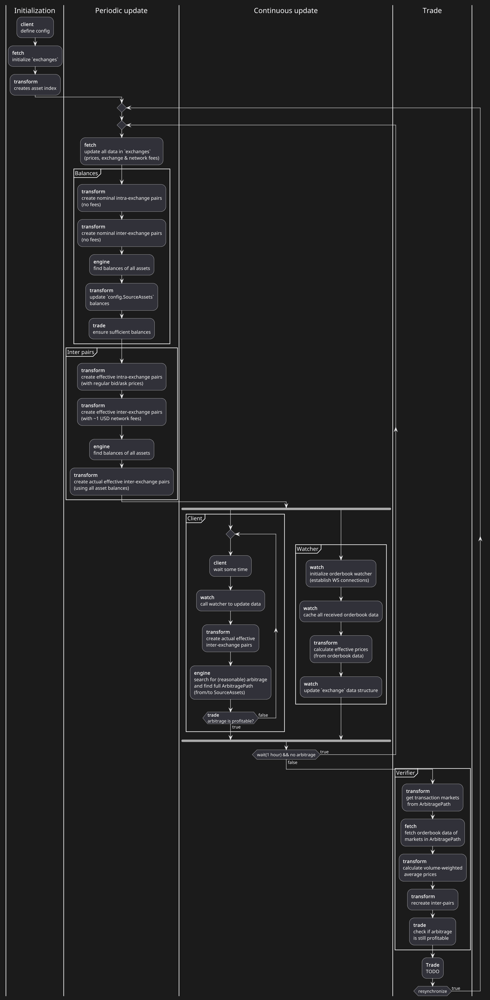

# Introduction

It was a hot day in May 2025, right after I finished all my semester exams. I knew I would have plenty of time during the summer, so I had to think of something interesting, creative, and useful for me to work on during the summer. This was the perfect project to select (_it took more time than just summer_ 😆).

## Motivation

Originally, I brainstormed many different project ideas across finance. Some were more interesting than others, and some were not really useful or interesting at all. Eventually, I came to the conclusion that only **market research** related ideas could be both interesting and practical as a personal project. 

By slowly narrowing the list of project ideas, I came across the topic of **triangular arbitrage**. It was (and probably still is) quite a popular _"trading strategy"_ across the retail crypto communities. I was skeptical initially, thinking that there were already many open source projects covering this topic. However, after some research on GitHub, I realized that there were not that many _good_ projects for this. 

Despite that, my financial intuition still suggested that these markets are efficient and the arbitrage opportunities are marginal. Either way, I went for it because this idea had the most potential. I also knew it would improve my programming skills, let me properly learn the Go programming language, and most importantly allow me to practice with real-world trading exchange APIs and better understand market microstructure. The cryptocurrency ecosystem was also the best for this project because it is one of the most open financial currency markets. This project was definitely **the right choice**.

## Research

I initially started researching this topic by looking at existing open source GitHub projects. There were many that implemented basic proof-of-concept modeling and optimization, however most of them did not even account for fees. There were a couple that accounted for fees, however they either did not account for liquidity or they only supported a single exchange. Therefore, I realized that none of these projects properly implemented a multi-exchange solution that accounts for fees and liquidity to identify _real_ arbitrage opportunities, not merely as a proof-of-concept algorithm.

Existing projects primarily used two kinds of approaches to model and identify arbitrage opportunities. 

1. **Graph approaches:** use graph theory to model the currency system as nodes (currencies) connected with directed weighted edges (markets) representing exchange rates. Graph theory algorithms are used to efficiently traverse the graph and identify arbitrage opportunities.
2. **Mathematical programming approaches:** use a mathematical programming method to model the problem as a profit maximization objective function under path-dependent constraints, typically using mixed-integer programming.

Most projects used graph-based approaches because they are more intuitive, simpler to implement, and very efficient. Mathematical programming is less commonly used, likely due to higher complexity and potentially lower efficiency, even though it allows for much more versatile model formulation. There were also a few advanced approaches using machine learning methods, however the formulation and models are quite different.

After thorough research, I decided to select the **graph approach** to implement this project since it is easier to implement, much more efficient, and I already knew how to properly incorporate fees and liquidity into the model.

# Implementation

I called the project **Arbitrage Inspector**. To implement it I selected the Go programming language. I already wanted to learn Go by using it in a project and I knew that it is quite fast and suitable for this application. Additionally, while researching available libraries for exchange APIs, I was happy to find that [CCXT](https://github.com/ccxt/ccxt), one of the most popular cryptocurrency exchange API libraries, was releasing its initial version for Go. I would really like to thank the developers of CCXT for developing such an amazing library, without it I probably wouldn't have been able to implement this project. 

After selecting **Go with the CCXT library**, I still had to design a good currency system model that accounts for fees and liquidity, and select a reliable arbitrage detection algorithm.

## Model architecture

In the graph approach, the currency system is modeled as a **weighted directed graph**. Each node represents a specific currency. Nodes are connected with weighted directed edges which correspond to exchange rates.

As previously mentioned, most existing implementations were limited to a single exchange, however I wanted to make it **multi-exchange**. Luckily, there is a natural way to add multiple exchanges to a graph structure. This is done by having each node represent a specific currency on a specific exchange, and connecting each currency with its equivalents across all exchanges by matching a currency ticker and selecting a shared crypto network. 

With this implementation model there are two kinds of transactions:

1. **Intra-exchange:** buying or selling currencies on markets within an exchange
1. **Inter-exchange:** transferring a currency from one exchange to another over a crypto network

Different treatment is applied to each type of transaction. This will be further explained in the following sections.

Below you may see an interactive example of the graph model with two exchanges and several currencies:

```{python}
# | label: fig-graph-model
# | fig-cap: "multi-exchange currency system represented as a graph"
# | echo: false
import plotly.graph_objects as go
import random

exchanges = ['Binance', 'Kraken']
currencies = ['BTC', 'ETH', 'SOL', 'XRP', 'USDT']
intra_pairs = [
    ('BTC', 'USDT'), ('ETH', 'USDT'), ('SOL', 'USDT'), ('XRP', 'USDT'),
    ('ETH', 'BTC'), ('SOL', 'BTC'), ('XRP', 'BTC'), ('SOL', 'ETH'), ('XRP', 'ETH')
]

colors = {
    'Binance': '#FFD700', 'Kraken': '#A855F7',
    'BTC': '#F7931A', 'ETH': '#627EEA', 'SOL': '#AA42F7', 'XRP': '#3466AA', 'USDT': '#26A17B'
}

base_rates = {
    'BTC': 67000.0,
    'ETH': 3500.0,
    'SOL': 160.0,
    'XRP': 0.55,
    'USDT': 1.0
}

cx = {'BTC': 0, 'ETH': 50, 'SOL': 100, 'XRP': 150, 'USDT': 200}
cy = {'BTC': 0, 'ETH': 40, 'SOL': -40, 'XRP': 40, 'USDT': 0} 
ez = {'Binance': 0, 'Kraken': 80} 

random.seed(42)

pos = {}
for e in exchanges:
    for c in currencies:
        jitter_x = random.uniform(-12, 12)
        jitter_y = random.uniform(-12, 12)
        jitter_z = random.uniform(-5, 5)
        pos[f'{e} | {c}'] = (cx[c] + jitter_x, cy[c] + jitter_y, ez[e] + jitter_z)

fig = go.Figure()

fig.add_trace(go.Scatter3d(
    x=[p[0] for p in pos.values()], y=[p[1] for p in pos.values()], z=[p[2] for p in pos.values()],
    mode='markers+text',
    marker=dict(size=18, color=[colors[c] for c in currencies * 2], line=dict(color='white', width=1.5)),
    text=currencies * 2, textfont=dict(color='white', size=11, weight='bold'), textposition='middle center',
    hovertext=list(pos.keys()), hoverinfo='text',
    hoverlabel=dict(bgcolor='#222', font=dict(color='white', size=12)), showlegend=False
))

edge_hover_layout = dict(bgcolor='#222', font=dict(color='white', size=12))

for ex in exchanges:
    px, py, pz = [], [], []
    intra_hover_text = []
    
    for a, b in intra_pairs:
        p1, p2 = pos[f'{ex} | {a}'], pos[f'{ex} | {b}']
        px += [p1[0], p2[0], None]
        py += [p1[1], p2[1], None]
        pz += [p1[2], p2[2], None]
        
        rate = base_rates[a] / base_rates[b]
        rate_str = f"{rate:,.2f}" if rate >= 1.0 else f"{rate:.4f}"
        
        edge_label = f"{ex} | {a}/{b} ≈ {rate_str}"
        intra_hover_text += [edge_label, edge_label, None]
        
    fig.add_trace(go.Scatter3d(
        x=px, y=py, z=pz, mode='lines', 
        line=dict(color=colors[ex], width=2.5), 
        name=f'{ex} (intra-exchange)',
        hovertext=intra_hover_text,
        hoverinfo='text',
        hoverlabel=edge_hover_layout
    ))

px, py, pz = [], [], []
inter_hover_text = []

for c in currencies:
    p1, p2 = pos[f'Binance | {c}'], pos[f'Kraken | {c}']
    px += [p1[0], p2[0], None]
    py += [p1[1], p2[1], None]
    pz += [p1[2], p2[2], None]
    
    fee_pct = random.uniform(0.012, 0.08)
    received = 1.0 - (fee_pct / 100)
    edge_label = f"1 {c} (Binance) → {received:.5f} {c} (Kraken)"
    inter_hover_text += [edge_label, edge_label, None]

fig.add_trace(go.Scatter3d(
    x=px, y=py, z=pz, mode='lines', 
    line=dict(color='#00CCCC', width=2.5), 
    name='inter-exchange',
    hovertext=inter_hover_text,
    hoverinfo='text',
    hoverlabel=edge_hover_layout
))

fig.add_trace(go.Scatter3d(
    x=[-35, -35], y=[0, 0], z=[ez['Binance'], ez['Kraken']], mode='text', text=exchanges,
    textfont=dict(color=[colors[ex] for ex in exchanges], size=16, weight='bold'), showlegend=False, hoverinfo='skip'
))

fig.update_layout(
    paper_bgcolor='rgba(0,0,0,0)', plot_bgcolor='rgba(0,0,0,0)', margin=dict(l=0, r=0, t=0, b=0),
    scene=dict(
        xaxis_visible=False, yaxis_visible=False, zaxis_visible=False, bgcolor='rgba(0,0,0,0)',
        aspectmode='data', camera=dict(eye=dict(x=1.3, y=1.5, z=0.8), center=dict(x=0, y=0, z=0))
    ),
    legend=dict(x=0.02, y=0.98, xanchor='left', yanchor='top', bgcolor='rgba(0,0,0,0.4)', font=dict(color='#ccc', size=11))
)

fig.show()
```

Once the graph is constructed, arbitrage detection becomes a graph algorithm problem. If the product of weights along a cycle exceeds 1, there is an arbitrage opportunity. By taking the negative natural logarithm of each weight, the multiplicative problem becomes additive. Therefore, a profitable cycle corresponds to a cycle with a negative sum of transformed weights, also known as a **negative weight cycle**. I used the **Bellman-Ford algorithm** to find these because it handles negative weights natively and runs in $O(V\times E)$. This is a rather standard implementation for arbitrage detection in a graph structure.

However, there is one more detail: investment capital should be stored somewhere. It can be stored in a single source node, but that is not ideal. Instead, I changed the model to allow for multiple source assets by adding a virtual **super-source** node at index 0 connected to each source asset with weight 1. This way, Bellman-Ford finds cycles reachable from any of the capital sources in a single pass. This extension allows storing capital in many exchanges at the same time, potentially reducing transaction costs and increasing exposure to arbitrage opportunities.

Of course, the model above assumes no transaction costs and **ignores real complexities**: variable fees, fixed fees, and order book liquidity. The next three sections explain how I dealt with each of these issues.

## Accounting for fees

Depending on the size of the transaction, fees can significantly impact the actual cost of the transaction, and thus the arbitrage opportunity. Therefore, it is crucial to account for all kinds of fees. Accounting for them is rather straightforward. The fee can be incorporated into the exchange rate before a graph is constructed, making all weights represent **net exchange rate**.

For intra-exchange transactions it is pretty simple because taker/maker fees are proportional to the transacted amount; just apply the formula $w^{\text{intra}}_{ij}=e_{ij}\times(1-f_{\text{market}})$ to each of the weights. However, for inter-exchange transactions it is much more complicated because network transaction fees are denominated in fixed amount of the transacted currency (e.g., you pay a fixed 0.00001 SOL to transfer any amount of SOL across exchanges). 

The fixed nature of network transaction fees makes them incompatible with the weighted directed graph model because the transacted quantity itself determines the relative proportion of the fee, and therefore of the weight as well. Given that I was already too invested in this modeling approach, I decided to find a workaround which would allow me to at least approximate the weights of inter-exchange edges. 

After some brainstorming, I figured out that it is still possible to convert the fixed fees into percentage fees, but only if I know the nominal value of the transaction relative to the fee. In order to do that, I had to first obtain the nominal value of the investment capital in all possible currencies, which I did by computing shortest paths to all currencies from a reference currency (e.g. USDT) and then calculating the nominal value of the investment in all currencies using those shortest path values. Note that this assumes a **fixed amount of investment capital**. Afterward, when computing the inter-exchange fees, I had to calculate the amount of **network fee relative to the total capital** to find the correct inter-exchange weights: $w^{\text{inter}}_{ij}=1\times (1-\frac{f_{\text{network}_{ij}}}{I_{i}})$.

## Accounting for liquidity

Bid and ask prices may **not** be a good representation of **actual market prices**. Market orderbooks have varying amounts of liquidity on both sides, and it is crucial to properly account for it. However, accounting for liquidity is not very straightforward.

Similar to how I handled the fixed network fees, I also had to assume a fixed amount of investment capital. Then I could reuse the previously calculated nominal value of investment in all currencies to compute volume-weighted average price (VWAP) for both bid and ask sides. This approach allows me to properly account for liquidity, assuming fixed investment capital.

$$\displaystyle VWAP = \frac{\displaystyle\sum_{i=1}^{n} (P_i \times Q_i)}{\displaystyle\sum_{i=1}^{n} Q_i}$$

However, I missed one crucial implementation detail. It is rather difficult to obtain orderbooks for _thousands_ of markets in real time... 😅

CCXT does support a REST API method for obtaining orderbooks for all markets in an exchange in one API call, however very few exchanges support this endpoint. There is also a similar method for WebSocket (WS) connections to listen to orderbooks of multiple markets at the same time (with a max market limit). Therefore, I designed a dynamic **watcher** system which spawns individual exchange watchers, which spawn individual workers to listen to dedicated WS connections. The watcher runs asynchronously along the main logic and continuously collects new orderbook updates. Once data refresh is needed, the watcher synchronizes all cached orderbook data and updates the main market orderbook data structure.

In the end, it became a sophisticated dynamic asynchronous system which unfortunately didn't really work due to hidden WS API differences and rate limits. I even tried fine-tuning the frequency of WS connection requests, number of markets per WS connection, and other parameters to avoid rate limits, however only a few exchanges provide consistent results. Therefore, due to technical limitations, it is not really possible to account for liquidity by precalculating all VWAP prices. 

Ideally, this networking restriction could have been solved by increasing API limits or using proxies to watch WS connections, however that probably would have been overly complicated.

As a temporary workaround, the main branch of the project includes the _fetcher_ version of the algorithm which ignores liquidity when constructing a graph and checks it only after it finds a potential arbitrage opportunity. The watcher version is also available in a dedicated branch, however it only supports a few tested exchanges.

## Development

The actual code implementation was a bit tricky because of many interdependent processes in the model. It required well-designed data structures, robust functions, and coordinated architecture to minimize the time from updating market data to identifying a concrete arbitrage opportunity. 

The code is structured following separation of concerns based on functionality. The client (CLI, TUI, etc.) orchestrates the main processes using six internal packages/modules: 

1. **Engine:** responsible for optimization algorithms
2. **Fetch:** responsible for fetching data using CCXT via REST APIs
3. **Models:** includes all shared data structures for config, exchange market data, graph structures, etc.
4. **Trade:** responsible for verifying and executing trades (wasn't fully implemented)
5. **Transform:** includes all main data transformation functionality
6. **Watch:** includes the watcher implemented using CCXT via WebSocket APIs

For more implementation details you may check the [project package documentation](https://github.com/life00/arbitrage-inspector/tree/master/docs/packages) for each of the internal packages used in the execution process.

The main control flow process is split into four key stages: initialization, periodic update, continuous update, and trade. Each stage handles a different kind of processing. You may find the process control flow illustration below.

<details>
<summary>Process control flow (click to expand)</summary>



</details>

Notice that continuous update is only responsible for updating the market data and finding the arbitrage. Other, less frequently updated data is handled by periodic update, such as inter-exchange weights and investment capital denominations in all currencies. This ensures that only the most essential data is updated on each arbitrage detection refresh.

# Evaluation

Overall, I think the **project is a success** despite the implementation issues and limitations because it let me learn and work with quant finance in practice. Given that I am now aware of the technical and algorithmic limitations, this project could potentially be redesigned to follow a more robust and realistic architecture.

## Results

Using the developed algorithm, I was able to see for myself that **arbitrage opportunities slowly diminish** when accounting for fees and liquidity. Without fees or liquidity, it can easily identify major arbitrage opportunities with +3% return. With fees but without liquidity, it can identify marginal arbitrage opportunities with +1% return. Once liquidity is also considered, it is rarely able to reliably identify any arbitrage opportunities.

I also realized that investment quantity is another crucial factor to account for. If it is too large, then arbitrage opportunities disappear due to insufficient liquidity, while if it is too small, the opportunity is diminished by fixed fees. This creates an additional **quantity optimization** problem where the optimal quantity must balance the costs of liquidity against fixed fees.

The last release (v0.7) marked the first version that could identify potentially real arbitrage in live market data. With around 2500 assets and 6000 pairs across multiple exchanges, the full detection cycle, from fetching fresh data to identifying a cycle, completes in under 400 milliseconds, which is not really ideal. Real opportunities were most reliably found with capital below $500, especially during periods of volatility. However, I did not track formal profit-and-loss over time, so these findings are observational rather than rigorously measured.

The algorithm also has **structural gaps** that likely caused it to miss opportunities. Bellman-Ford finds the first negative cycle, not the best or shortest one, and the path from source assets back to themselves after a cycle is not properly implemented for all cases. 

## Limitations and Next Steps

As I already mentioned, there are many limitations. The primary one is related to obtaining large quantities of orderbooks in real time. The watcher system I built to solve this became a sophisticated dynamic asynchronous system that didn't really work due to hidden WS API differences and rate limits.

Beyond the data access problem, the **graph model** itself was the **root cause of many limitations**. Everything (fees, liquidity, network costs) must be compressed into a single edge weight, which forces simplifying assumptions like fixed capital. Bellman-Ford finds the first negative cycle, not the most profitable one. The path from source assets back to themselves is not properly implemented. Network transaction speeds, which can void an arbitrage opportunity before a transfer completes, cannot be expressed in a static graph at all. There are also other issues: non-optimal performance, overcomplicated model, no trade execution (the project currently detects but does not trade). You may find the full list [here](https://github.com/life00/arbitrage-inspector/blob/master/docs/other/problems.md).

Given these fundamental limitations, many of which stem from the graph modeling approach itself, a redesign from scratch would probably be more effective than patching the current one. I've recently been studying mathematical optimization more, and I can see how a **hybrid approach** could work better: scan for opportunities with graph algorithms, then optimize the quantity with mathematical programming. That would capture more of the real-world complexity that the current model has to ignore.
